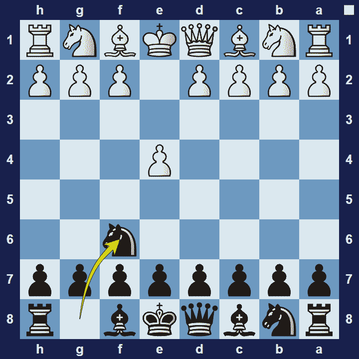
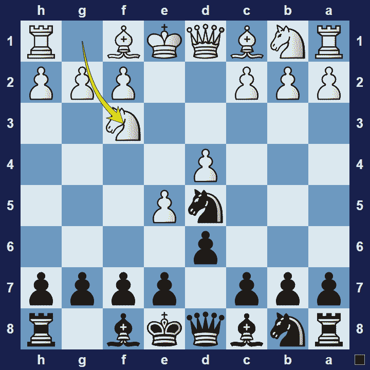

# Alekhine’s Defense

## Alekhine’s Defense

1.e4 Nf6

### Alekhine’s Defense Basic Theory

The opening is named after Alexander Alekhine, the fourth world champion, who played it in two of his games in a tournament in Budapest, 1921.

Alekhine’s Defense is ahypermodern openingfrom black’s perspective. Black dares white to grab space in the center with the moves 2.e5 Nd5 3.c4. Black then intends to attack and undermine white’s central pawns. However, if white manages to effectively support their central pawns, white will enjoy a strong advantage in the center.

A common variation in the Alekhine Defense Opening is The Modern Variation.

### Alekhine’s Defense Modern Variation

1.e4 Nf6 2.e5 Nd5 3.d4 d6 4.Nf3

In the Alekhine Defense Modern Variation white takes a more cautious approach. White doesn’t play 4.c4 and, instead, supports the centre with 4.Nf3.

### The Pros and Cons of Alekhine’s Defense

Since white’s options are limited against Alekhine’s Defense you can force your opponent to play the opening on your terms. You might even get an advantage if your inexperienced opponent is tempted to make too many pawn moves. However, if you fail to properly execute your strategy, your opponent will enjoy a strong centre and your position will be cramped.

Note:When the word “defense” appears in the name of an opening, such as Alekhine’s Defense, it usually refers to a choice of opening by black. Ironically though, in many cases the use of the word “defense” can be quite misleading, I.e. the Sicilian Defense is a very aggressive opening.

## Images

## Extra Information
**Description:** Viktor Korchnoi also included the defense in his repertoire, leading to its respectable reputation. Viktor Korchnoi. Nowadays, Alekhine's defense is not so common at the top level. De Firmian observes, "The fashion could quickly change if some champion of the opening takes up the cause, as the results Black has obtained in practice are good."

**Source:** [Link](https://www.chess.com/blog/ThummimS/the-history-and-use-of-the-alekhines-defense-1)
