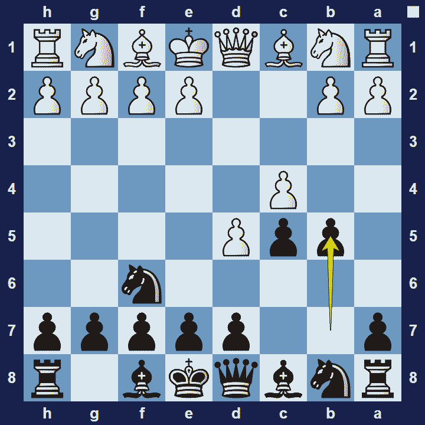
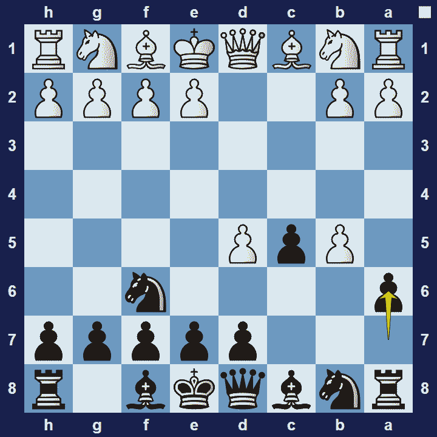

# Benko Gambit

## Benko Gambit

1.d4 Nf6 2.c4 c5 3.d5 b5

### Benko Gambit Basic Theory

The Benko Gambit, also known as the Volga Gambit or the Volga-Benko Gambit (named after Pal Benko and the Volga River), is agambit openingfrom black’s perspective.

The Benko Gambit is a rather unique response to 1.d4 where black wants to sacrifice a pawn in the hope to obtain lasting pressure–through active pieces and open files on the queen-side. Black’s strategy is then further enhanced by placing a fianchettoed bishop on g7 which can potentially heap immense pressure on white’s queenside. Black should approach these ideas energetically–or else risk losing the initiative if white finds the time to organize a solid defense.

If white declines the gambit then the game will likely enter a position resembling theBenoni Defense, and offers black a completely playable position. However, a popular response for white is to accept the gambit, leading to the Benko Gambit Accepted variation.

### Benko Gambit Accepted Variation

1.d4 Nf6 2.c4 c5 3.d5 b5 4.cxb5 a6

### The Pros and Cons of the Benko Gambit

The Benko Gambit is an ideal opening for situations where black is willing to take on some risk–in return for increased winning chances. However, white can always decline the gambit and they have many options to choose from. If you play the Benko Gambit, you will likely get exciting opportunities against all but the most experienced opponents.

Note:In chess, a gambit refers to an opening move in which a player makes a sacrifice, typically of a pawn, in return for a compensating advantage, such as speedy development of their pieces.

## Extra Information
**Description:** The name Benko Gambit stuck and is particularly used in English-speaking countries. In his 1974 book, Benko drew a distinction between the Benko Gambit and the Volga Gambit: "Volga Gambit" referred to the move 3...b5 (sometimes followed by an early ...e6), while the "Benko Gambit" consisted of the moves 3...b5 4.cxb5 a6, now considered the main ...

**Source:** [Link](https://en.wikipedia.org/wiki/Benko_Gambit)
