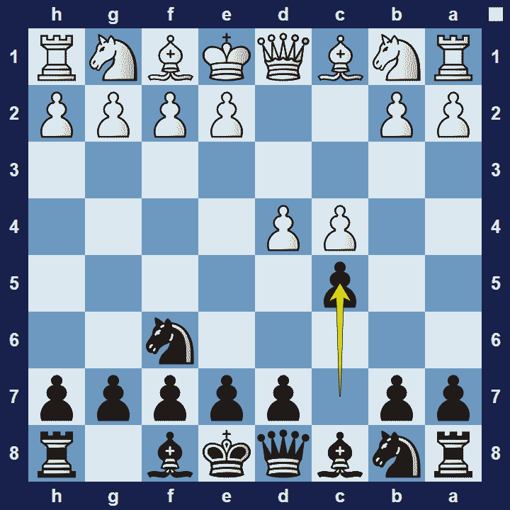
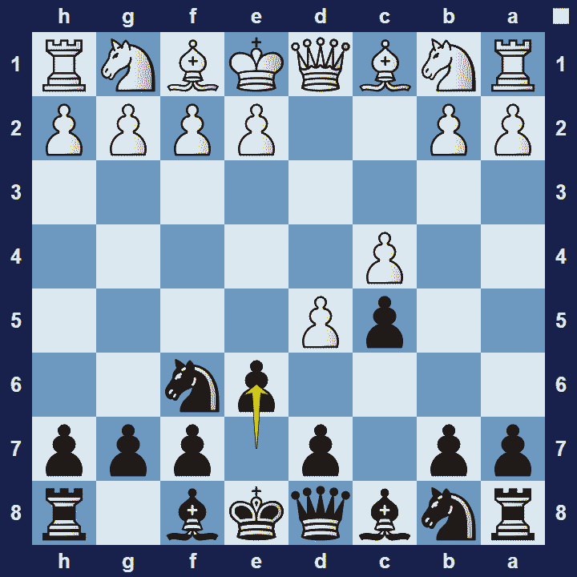

# Benoni Defense

## Benoni Defense

1.d4 Nf6 2.c4 c5

The name of this opening is linked to a book published in 1825, by Aaron Reinganum, who apparently studied chess to alleviate depression. He referred to his writings as Ben-Oni (an ancient Hebrew name, meaning “son of my sorrow”).

The Benoni Defense is an aggressive opening, from black’s perspective, characterized by the initial moves 1.d4 Nf6 2.c4 c5, by which black intends to exchange their flank c-pawn for white’s central d-pawn.

### Benoni Defense Basic Theory

In the Benoni Defence, black’s overarching strategy is to create significant imbalances in the position. Imbalances will create more dynamic opportunities and thus black will get more winning chances than they would typically get from a more solid response. This benefit comes, of course, at the cost of increased losing chances too! That is why top chess players favor this opening in “must-win” match situations.

Note:After 1.d4 Nf6 2.c4 c5, white doesn’t win a pawn with 3.dxc5 because 3… e6, followed by Bxc5 will only help black. Alternatively, 1.d4 Nf6 2.c4 c5 3.dxc5 e6 4.b4 a5! is even better for black.

A popular variation in the Benoni opening is the Modern Variation.

### Benoni Defense Modern Variation

1.d4 Nf6 2.c4 c5 is 3.d5 e6

A popular response to 1.d4 Nf6 2.c4 c5 is 3.d5, to which black will mostly reply 3… e6, known as the Modern Variation of the Benoni.

With the move 3… e6, black’s strategy is to capture white’s pawn on d5, thereby creating a majority of black pawns on the queen-side. Black then intends to play g6 and Bg7, from where the bishop will support the advance of black’s queen-side pawn majority. Black will control the dark-squares, particularly the d4-square, whereas white will have more control over the light squares.

The obvious structural imbalances in the Modern Benoni reduces the chances of the game ending in a draw and gives both sides more winning chances. This is also why the opening has a reputation for being risky.

Even though Frank Marshall invented the Modern Benoni in 1927, it was only popularized 20 years later, primarily by Mikhail Tal, the highly tactical player from Latvia, who scored many brilliant victories with it.

### The Pros and Cons of the Benoni Defense

The Benoni Defense is an exciting opening that leads to highly imbalanced positions, which increases the likelihood of a decisive result. However, grandmasters will typically avoid this opening because they prefer quieter positions–where they can demonstrate their superior positional understanding.

## Extra Information
**Description:** The Benoni Defense, or simply the Benoni, is a chess opening characterized by an early reply of ...c5 against White's opening move 1.d4.. The original form of the Benoni, now known as the Old Benoni, is characterized by . 1. d4 c5. This leaves Black a few options such as an early ...f5 and an early dark-squared bishop trade by ...Be7-g5, but has the drawback that White is no longer committed ...

**Source:** [Link](https://en.wikipedia.org/wiki/Benoni_Defense)
