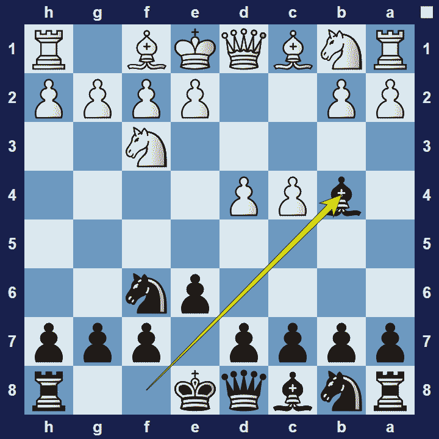
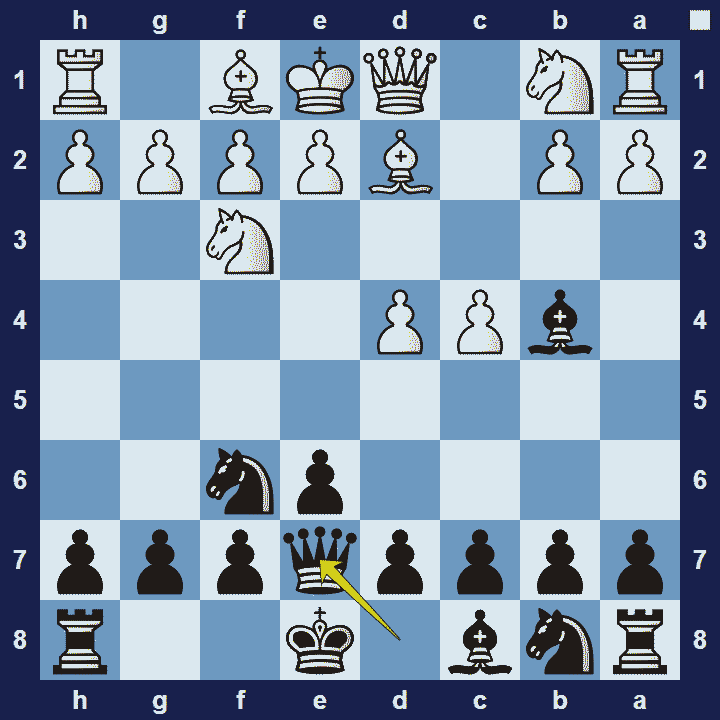

# Bogo-Indian Defense

## Bogo-Indian Defense

1.d4 Nf6 2.c4 e6 3.Nf3 Bb4+

The Bogo-Indian Defense is named after the Russian grandmaster Efim Bogoljubow. He famously said: “When I am White I win because I am White. When I am Black I win because I am Bogoljubov.”

### Bogo-Indian Defense Basic Theory

Black’s idea is very simple–to develop their king-side as quickly as possible, whilst disrupting white’s queen-side development. Once this is achieved, black will aim to undermine any white presence in the centre.

A popular variation in the Bogo-Indian Defense is the Nimzowitsch Variation.

### Bogo-Indian Defense Nimzowitsch Variation

1.d4 Nf6 2.c4 e6 3.Nf3 Bb4+ 4.Bd2 Qe7

If white blocks the check with 4.Bd2, black’s popular reply is 4… Qe7, which leads to the Nimzowitsch variation:

In the Nimzowitsch variation black defends the bishop with their queen, 4… Qe7. White usually avoids 5.Bxb4 Qxb4+, which may force white to give up a pawn.

### The Pros and Cons of the Bogo-Indian Defense

The Bogo-Indian Defense is reasonably easy to learn and it is also strategically sound. However, it is also not too difficult for white to maintain a space advantage and black typically won’t get many opportunities to complicate the position.

## Images

## Extra Information
**Description:** The Bogo-Indian Defence is named after the Russian-born German master Efim Bogoljubow who is believed to have originated the opening and played it regularly in the 1920s. Subsequent prominent players to have adopted the Bogo-Indian include Aron Nimzowitsch, Paul Keres, Tigran Petrosian, Bent Larsen, Vasily Smyslov, Viktor Korchnoi, Ulf Andersson, Michael Adams and Nikita Vitiugov.

**Source:** [Link](https://en.wikipedia.org/wiki/Bogo-Indian_Defence)
