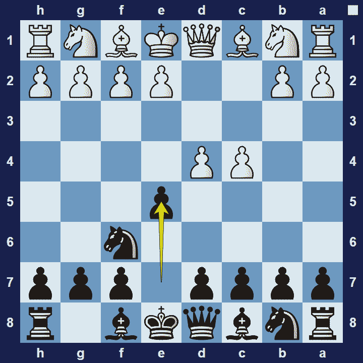
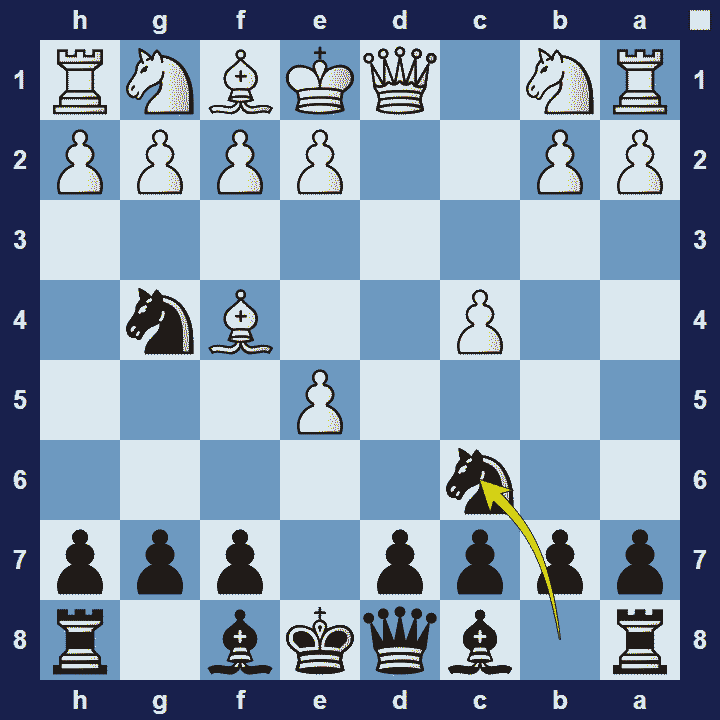

# Budapest Gambit

## Budapest Gambit

1.d4 Nf6 2.c4 e5

The Budapest Gambit is an opening for black, named after the location of the first know game featuring the moves 1.d4 Nf6 2.c4 e5. It was the game Adler–Maróczy (played in Budapest in 1896).

### Budapest Gambit Basic Theory

The Budapest Gambit is mostly used as a surprise weapon against people who are probably not up to date with the theory of the opening. It is a very aggressive approach by black, challenging the centre from the word go and potentially launching an all-out attack on the white. White shouldn’t try to keep their pawn on e5 as this will help black. Instead, white should aim to give back the pawn on favorable terms, for example gaining the bishop pair or forcing black to waste time regaining the pawn.

A popular variation in the Budapest Gambit is the Rubinstein Variation.

### Budapest Gambit Rubinstein Variation

1.d4 Nf6 2.c4 e5 3.dxe5 Ng4 4.Bf4

The Rubinstein variation refers to the first time when 4.Bf4 was employed, by Akiba Rubinstein, as white, against GM Milan Vidmar. Rubinstein actually won the game, which lead to more players adopting the move 4.Bf4.

Budapest Gambit Rubinstein Variation, to which the main response by black is 4… Nc6.

The game could then continue 5.Nf3 Bb4+ 6.Nbd2 Qe7 7.e3 Ngxe5 and black regains the lost pawn.

Shakhriyar Mamedyarov used the Budapest gambit against the former world champion, Vladimir Kramnik, in a rapid game in 2008. Mamedyarov won the game, which clearly proves the surprise value of this opening, even if it is a less common gambit. You can check the game here:Vladimir Kramnik vs Shakhriyar Mamedyarov

### The Pros and Cons of the Budapest Gambit

Although the Budapest gambit is rather unusual, it is still considered to be sound. This means you can lead your opponent into territory that may be unfamiliar to them, without risking too much. However, black has to spend time to get the pawn back and white can use this time to solidify some space advantage.

## Extra Information
**Description:** History Of The Budapest Gambit. The earliest record of the Budapest Gambit is from 1896, when GM Geza Maroczy played the opening to defeat Adler in Budapest. The opening then gained popularity when GM Milan Vidmar used it to defeat GM Akiba Rubinstein, one of the best players in the world at the time.. After this, other top players like GM Savielly Tartakower and Siegbert Tarrasch started to ...

**Source:** [Link](https://www.chess.com/openings/Budapest-Gambit)
