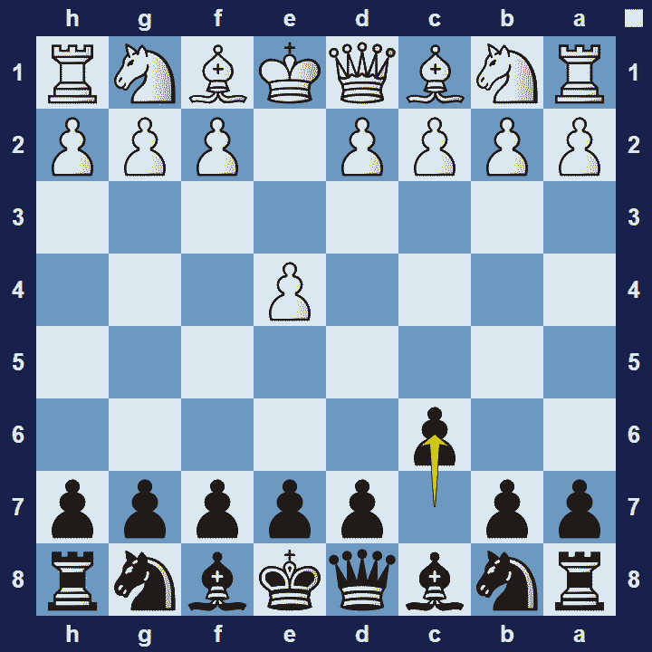
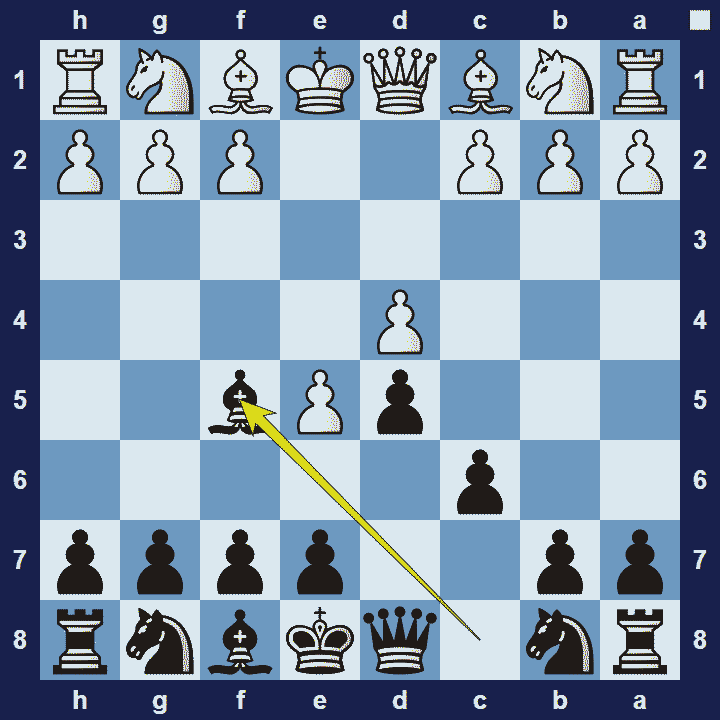

# Caro-Kann Defense

## Caro-Kann Defense

1.e4 c6

The Caro-Kann Defense is an opening for black, named after English player Horatio Caro and Austrian player Marcus Kann. These two analyzed the opening and published their analysis in the German chess magazine in 1886.

### Caro-Kann Defense Basic Theory

Black intends to occupy the centre with pawn to d5 (supported by a pawn on c6). Furthermore, black avoids any serious weaknesses in their pawn-structure and is assured of attaining a very solid, albeit slightly passive position.

A popular variation in the Caro-Kann opening is the Advance variation.

### Caro-Kann Defense Advance Variation

1.e4 c6 2.e5 Bf5

With 2.e5, white aims to solidify a space advantage in the centre. However, black’s has compensation in the fact that the centre is rather closed (making it harder for white to maneuver their pieces freely) and black’s light-squared bishop is free (in contrast with the French Defense where this bishop is locked in).

### The Pros and Cons of the Caro-Kann Defense

The Caro-Kann Defense is very popular opening among top players because it has a very solid reputation. A main advantage of the Caro-Kann is that black’s light squared bishop will not be trapped behind the pawn-structure. However, black has to settle for slower development and accept that there are many ways white can play against the Caro-Kann.

## Images

## Extra Information
**Description:** History. The Caro-Kann is named for Horatio Caro and Marcus Kann, two 19th century players who analyzed it. Its first appearance in a published game came between two unknown players in 1845, while the analysis by Caro and Kann came in the 1880s. Like many openings, the Caro-Kann did not gain much respect until the 20th century.

**Source:** [Link](https://www.chess.com/openings/Caro-Kann-Defense)
