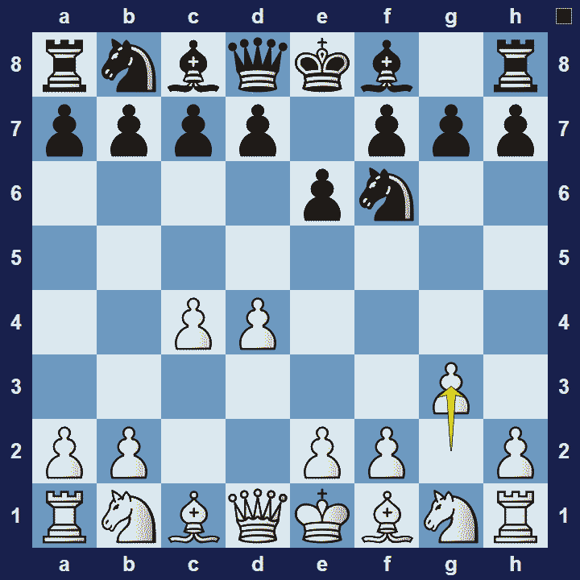
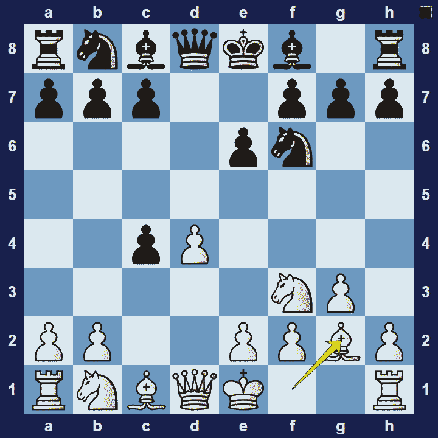

# Catalan Opening

## Catalan Opening

1.d4 Nf6 2.c4 e6 3.g3

The Catalan Opening is an opening for white, named after Catalonia, the location of a tournament in Barcelona, 1929, where the organizers asked Polish-French Grandmaster Savielly Tartakower to create a new variation in honor of the area’s chess history.

### Catalan Opening Basic Theory

White aims to get a solid foothold in the centre and then mounts pressure on the queen-side. To this end, the white bishop on g2 plays a prominent role in the Catalan opening and will coordinate it’s efforts particularly with white’s c-pawn.

A popular variation in the Catalan opening is the Open Defense.

### Catalan Opening Open Defense

1.d4 Nf6 2.c4 e6 3.g3 e6 4.Nc3 dxc4 5.Bg2

In the Open Defense variation of the Catalan Opening, black compromises their presence in the centre by capturing the white pawn on c4, but hopes to gain sufficient compensation in terms of extra time (since white must use a few moves to regain their sacrificed pawn).

### The Pros and Cons of the Catalan Opening

The Catalan Opening is a popular choice on the highest levels because white can often obtain long-term positional pressure. However, accumulating small advantages from a marginal positional advantage, against a strong player, will require advanced capabilities.

## Extra Information
**Description:** The Catalan Opening is a chess opening where White plays d4 and c4 and fianchettoes the white bishop on g2. A common opening sequence is 1.d4 Nf6 2.c4 e6 3.g3, although various other openings can transpose into the Catalan. The Encyclopaedia of Chess Openings (ECO) lists codes E01-E09 for lines with 1.d4 Nf6 2.c4 e6 3.g3 d5 4.Bg2; other lines are part of E00.

**Source:** [Link](https://en.wikipedia.org/wiki/Catalan_Opening)
