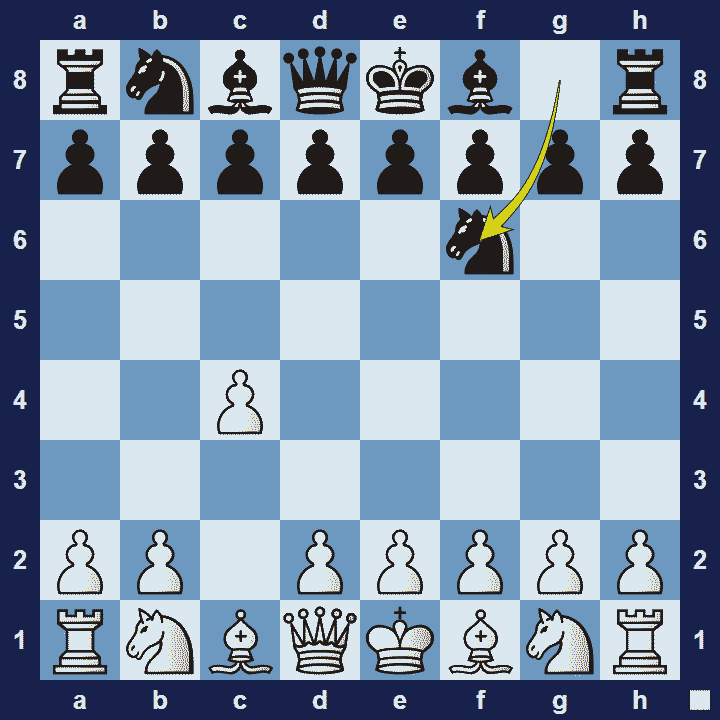

# English Opening

## English Opening

1.c4

The opening is named after Howard Staunton, the famous English chess master who was widely recognized as an unofficial world champion from 1843-1851. In those years (1840’s-1850’s) his contemporaries believed the opening to be inferior, partly due to the pawn on c4 restricting the white light-square bishop.

### English Opening Basic Theory

The English Opening is an opening for white that starts with the move 1.c4. In a pure English opening, white will aim to control the d5-square, with the help of a bishop on g2 and another pawn on e4, supported by a pawn on d3.

However, the English opening often transposes into another opening, such as theQueen’s Gambitor theCatalan Opening.

Note:In chess, transposition is the scenario where the exact same position is reached, but by a different sequence of moves. For example, the English Opening will often transpose into a variation of the Queen’s Gambit.

A popular variation in the English Opening is the Anglo Indian Defense.

### English Opening Anglo-Indian Defense

1.c4 Nf6

By playing 1… Nf6, black keeps their options open with this very flexible move. It also gives white an opportunity to transpose to another opening, such as the Queen’s Gambit.

### The Pros and Cons of the English Opening

In the English Opening white settles for slower development in return for long-term pressure on the queen-side. However, since white’s development is slower, there are less chances for a direct attack and black may be able to get a strong hold in the centre.

## Extra Information
**Description:** **1.c4** The English Opening is named after Howard Staunton who first played it in his match against De Saint Amant in 1843. 1.c4 did however not catch on with his contemporaries and it took until the 20th century, when players like Nimzovich, Reti, and Rubinstein drove forward its development. Every World Champion played the English Opening at some point in his career, with Botvinnik making a ...

**Source:** [Link](https://www.modern-chess.com/chess-openings/english-opening)
