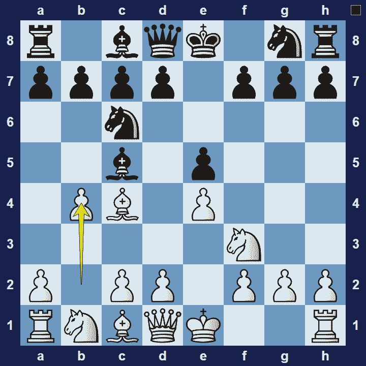
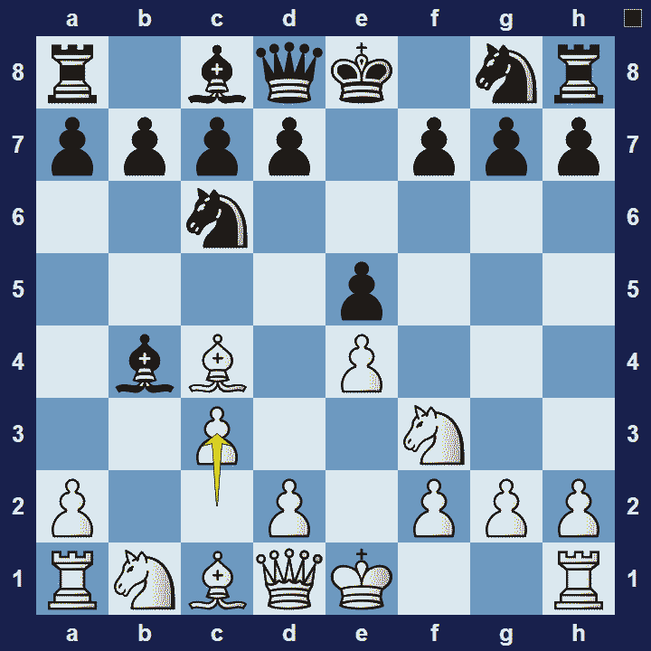

# Evans Gambit

## Evans Gambit

1.e4 e5 2.Nf3 Nc6 3.Bc4 Bc5 4.b4

The Evans Gambit is an opening for white, named after Captain William Davies Evans. He was a seafarer and inventor of the tri-colored lighting system–to prevent naval collisions at night. He played this opening against Alexander McDonnell, whilst on shore leave in London in 1825/1826.

### Evans Gambit Basic Theory

In typical gambit style, white sacrifices a pawn, with b2-b4, in order to get ahead in development. An important observation is that other gambits often sacrifice a pawn near the centre. In the case of Evans Gambit, white still has all their central pawns.

A popular variation in the Evans Gambit is the Evans Gambit Accepted.

### Evans Gambit Accepted

1.e4 e5 2.Nf3 Nc6 3.Bc4 Bc5 4.b4 Bxb4 c3

By accepting the gambit, black declares they will defend against white’s threats whilst aiming to catch up in development. If black can succeed in this, they will be a pawn ahead–with good chances to win the endgame.

### The Pros and Cons of Evan’s Gambit

The Evan’s Gambit is a very aggressive opening that gives white plenty attacking chances. However, there are risks. For one, black can decline the gambit safely. Also, if white’s attack fizzles out, black will simply have an extra pawn.

## Images

## Extra Information
**Description:** This week we turn our attention to one of the most swashbuckling of openings: the Evans Gambit. Unlike some other openings whose first use was surrounded by mystery and uncertainty, the origins of the Evans Gambit seem fairly clear. In 1826 or 1827 the Welsh sea captain and inventor William Davies Evans...

**Source:** [Link](https://www.chess.com/article/view/the-evans-gambit-a-history)
