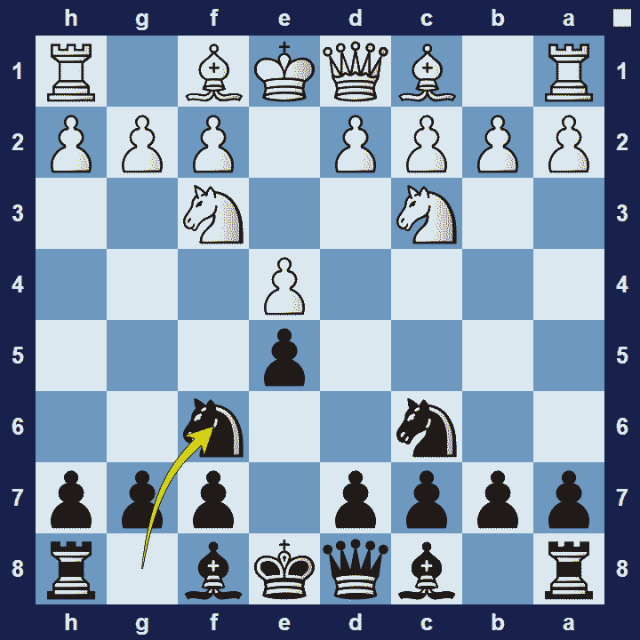
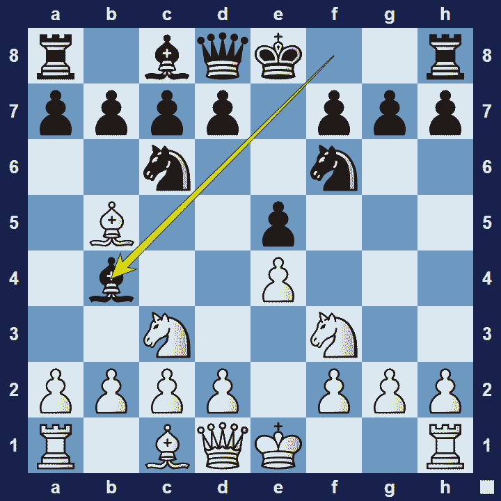

# Four Knights Game

## Four Knights Game

1.e4 e5 2.Nf3 Nc6 3.Nc3 Nf6

The Four Knights Game is an opening for black, named after the simple fact that the four knights are the first pieces to be developed in the game.

### Four Knights Game Basic Theory

Four Knights Game is a very principled opening, featuring very natural development from both sides. Both players develop their knights before the bishops. This is a little more flexible because, whereas the knights generally go to the c-and-f-files, it is a little less obvious where the bishops will go.

A popular variation in the Four Knights Game is the Double Spanish Variation (also known as the Symmetrical Variation).

### Four Knights Game Double Spanish Variation

1.e4 e5 2.Nf3 Nc6 3.Nc3 Nf6 4.Bb5 Bb4

Black hopes to get easy equality by keeping the position completely symmetrical.

### The Pros and Cons of the Four-Knights Game

The Four-Knights Game is a perfectly sound opening that features very natural development. However, some players may not like its simplicity. Also, due to it being very symmetrical, it may lead to rather drawish positions.

## Images

## Extra Information
**Description:** The Four Knights Game is a chess opening that begins with the moves: . 1. e4 e5 2. Nf3 Nc6 3. Nc3 Nf6. This is the most common sequence, but the knights may develop in any order to reach the same position. The Four Knights usually leads to quiet positional play, though there are also some sharp variations. The opening is fairly popular with beginners who strictly adhere to the opening ...

**Source:** [Link](https://en.wikipedia.org/wiki/Four_Knights_Game)
