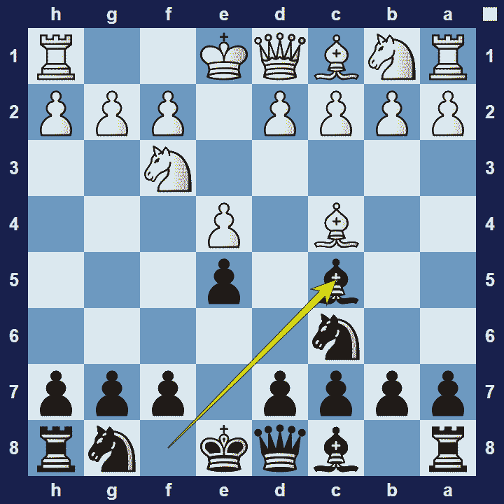

# Giuoco Piano

## Giuoco Piano

1.e4 e5 2.Nf3 Nc6 3.Bc4 Bc5

The Giuoco Piano is sometimes used interchangeably with the Italian Opening. However, the Giuoco Piano is actually a variation of the Italian Opening–specifically referring to the moves 1.e4 e5 2.Nf3 Nc6 3.Bc4 Bc5.

### Giuoco Piano Basic Theory

The Giuoco Piano is a very principled opening where both sides develop naturally. White choses to place their bishop on c4–from where it attacks the centre and takes aim at the f7-square. Black responds with the same idea, Bc5.

A popular variation in the Giuoco Piano is the Classical Variation.

### Giuoco Piano Classical Variation

1.e4 e5 2.Nf3 Nc6 3.Bc4 Bc5 4.c3 Nf6

In the classical variation of the Giuoco Piano, white plays the pawn-moves c3 and d3, controlling the centre with their pawns, whilst minimizing any potential weaknesses caused by advancing the pawns further.

### The Pros and Cons of the Giuoco Piano Opening

The Giuoco Piano is a solid opening with relatively simple theory and gives strategic players a good base to work from. However, due to the position being very balanced and very well known, the opening typically won’t lead to fireworks.

## Extra Information
**Description:** The Giuoco Piano (pronounced [ˈdʒwɔːko ˈpjaːno]; Italian for 'Quiet Game') [1] is a chess opening beginning with the moves: . 1. e4 e5 2. Nf3 Nc6 3. Bc4 Bc5 "White aims to develop quickly - but so does Black. White can construct a pawn centre but in unfavourable conditions a centre which cannot provide a basis for further active play." [4]The name "Italian Game" is also commonly used ...

**Source:** [Link](https://en.wikipedia.org/wiki/Giuoco_Piano)
