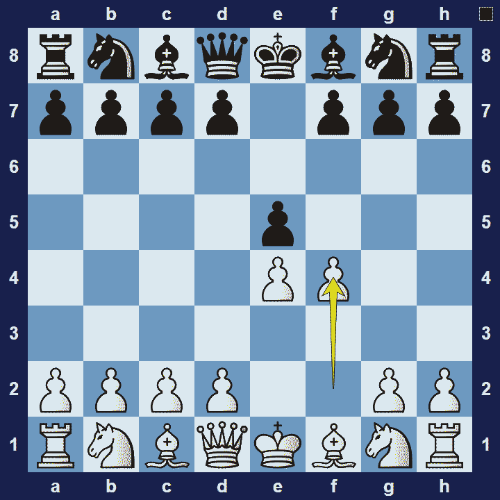
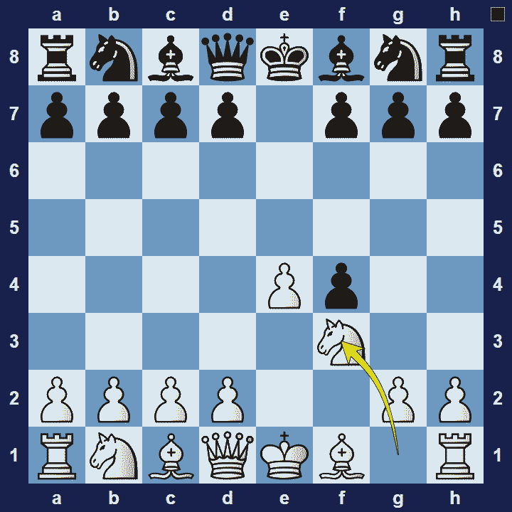

# King’s Gambit

## King’s Gambit

1.e4 e5 2.f4

The King’s Gambit is an opening for white, named after the early pawn-sacrifice offered on the king-side of the board.

### King’s Gambit Basic Theory

In the King’s Gambit white sacrifices a pawn, but also compromises the safety of their king, in exchange for rapid development and attacking opportunities on black’s king.

A popular variation in the King’s Gambit is the King’s Gambit Accepted.

### King’s Gambit Accepted

1.e4 e5 2.f4 exf4

If black accepts the pawn (the King’s Gambit Accepted), white usually responds with 3.Nf3–to prevent the immediate threat, Qh4+. White gets a stronger centre and quick development, at the cost of a pawn and compromised king-safety. The logical strategy for white is to attack quickly, before black manages to coordinate their defenses. Black, on the other hand, will seek to defend tenaciously whilst looking for an opportunity to launch a counter-attack on white’s king.

Another popular option for black is to decline the gambit and instead play 2… d5 (the Falkbeer counter-gambit).

### The Pros and Cons of the King’s Gambit

The King’s Gambit is a very exciting opening, particularly among spectators of the game! Although it’s a fun opening, white takes on a lot of risk by exposing their king. And since the opening has been studied extensively, there are many known ways for black to deal with the King’s Gambit.

## Images

## Extra Information
**Description:** This is an opening which originated in the 16th century, and whose death has frequently been announced -- from Rudolf Spielman's mournful 1924 article "From the Deathbed of the King's Gambit," to Bobby Fischer's 1961 "A Bust to the King's Gambit," to the recent April 1, 2012 hoax claiming that computers had "solved" it to a forced win for Black.

**Source:** [Link](https://www.chess.com/article/view/the-history-of-the-kings-gambit)
