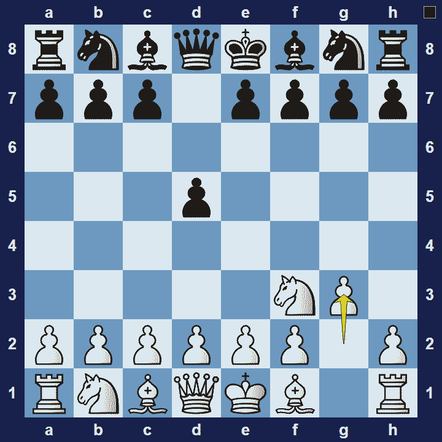
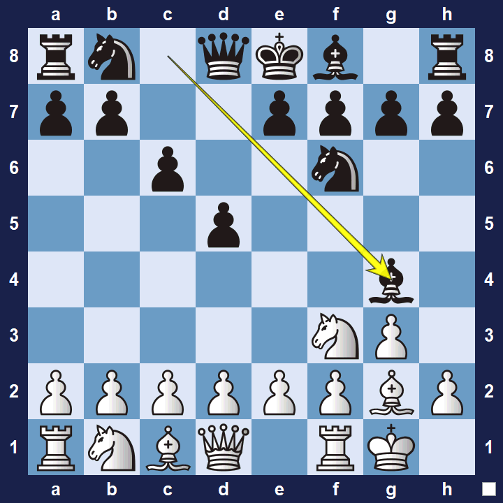

# King’s Indian Attack

## King’s Indian Attack (KIA)

1.Nf3 d5 2.g3

The King’s Indian Attack, also known as the Barcza System (named after Gedeon Barcza), is a chess opening system for white that mirrors the popular King’s Indian Defense (from black’s side of the board).

### King’s Indian Attack Basic Theory

The King’s Indian Attack is often characterized by an all out attack on black’s king-side.

However, before they can attack, white typically aims to:

- Develop the pieces and get their king safe (castle).

- Get a pawn to e5 from where it gives white a space-advantage on the kingside (if black has a pawn on e5, white usually wants to attack it–by preparing to play f2-f4).

- White’s usually avoids pointless piece-exchanges early on–they need the pieces to attack.

However, white should be flexible too. Depending how black plays, white may decide to rather focus on the center or expand on the queen-side.

A popular variation in the King’s Indian Attack is the Yugoslav Variation.

### King’s Indian Attack Yugoslav Variation

1.Nf3 d5 2.g3 Nf6 3.Bg2 c6 4.O-O Bg4

The Yugoslav Variation is characterized by black’s move 4… Bg4. By attacking (and potentially pinning) the knight on f3, black anticipates that white typically wants to use the e5-square as a base to attack from.

Note:When the word “Attack” appears in the name of an opening, it usually refers to an opening from white’s point of view. For example, The King’s-Indian Attack resembles the same setup for white as the King’s-Indian Defense does for black.

### The Pros and Cons of the King’s-Indian Attack

The King’s Indian Attack is fairly easy to learn because it is not very theoretical. White can often launch a promising king-side attack. However, since white doesn’t challenge the centre early on, there are many ways for black to get a decent position.

## Images

## Extra Information
**Description:** The King's Indian Attack (or KIA) is a chess opening system where White adopts the setup more commonly seen being played by Black in the King's Indian Defence.The King's Indian Attack is characterised by the following moves: the central pawns are developed to e4 and d3, the knights are developed to d2 and f3, the king's bishop is fianchettoed at g2 following the g-pawn's move to g3, and White ...

**Source:** [Link](https://en.wikipedia.org/wiki/King's_Indian_Attack)
