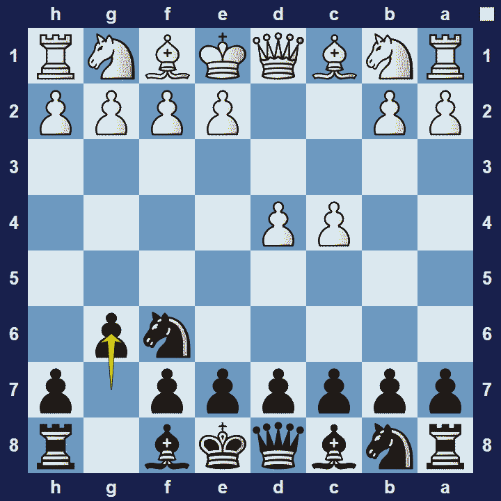
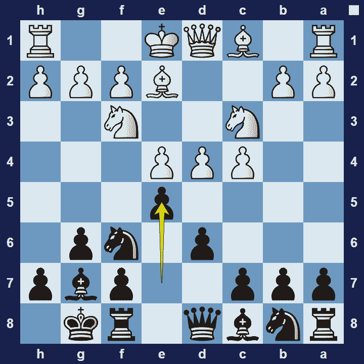

# King’s Indian Defense

## King’s Indian Defense (KID)

1.d4 Nf6 2.c4 g6

The King’s Indian Defense is an opening for black that mirrors the King’s-Indian Attack for white. The family of Indian Openings are named after the opening moves used by Moheschunder Bannerjee, a strong Indian chess player, in the late 19th century.

### King’s Indian Defense Basic Theory

The King’s Indian Defense follow hypermodern principles. That is, black allows White to build a strong pawn center to later counter-attack it with a pawn-push, either e5 or c5. Black will support the pawn-push with their minor pieces, prominently the fianchettoed bishop on g7.

A popular variation in the King’s Indian Defense is the Classical Variation.

### King’s Indian Defense Classical Variation

1.d4 Nf6 2.c4 g6 3.Nc3 Bg7 4.e4 d6 5.Nf3 0-0 6.Be2 e5

The Classical Variation of the King’s Indian Defense refers to the classical approach from white. That is, to occupy the centre with their pawns.  White will generally aim to create a breakthrough on the queenside–with the pawn push c5. Black should try to block this pawn-advance by placing a knight on c5. If black manages to restrain white’s ideas on the queen-side, they can launch a promising attack on the white king.

### The Pros and Cons of the King’s-Indian Defense

The King’s-Indian Defense is a very dynamic opening for black and it leads to interesting positions. Even though black can often attack on the king-side, white usually has a space-advantage in the centre and it can be difficult for black to deal with pressure on the queen-side.

## Images

## Extra Information
**Description:** The earliest known use of the term "Indian Defence" was in 1884.The modern names "King's Indian Defence", "King's Indian Attack", etc. arose in the mid-twentieth century and are attributed to Hans Kmoch.Until the mid-1930s, the King's Indian Defence was generally regarded as highly suspect, but the analysis and play of three strong Soviet players in particular—Alexander Konstantinopolsky ...

**Source:** [Link](https://en.wikipedia.org/wiki/King's_Indian_Defence)
