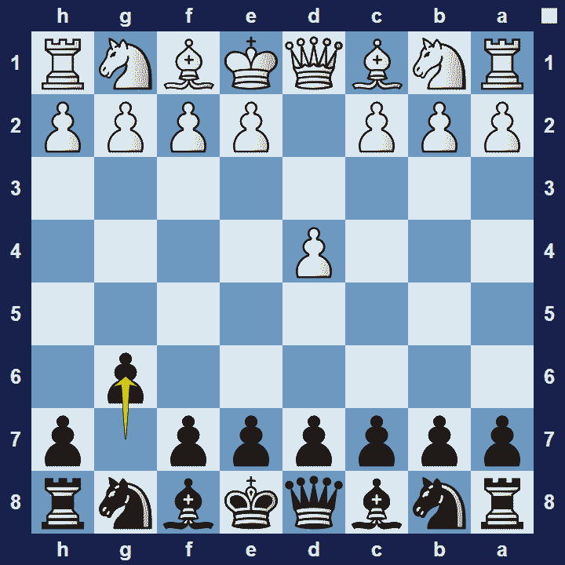
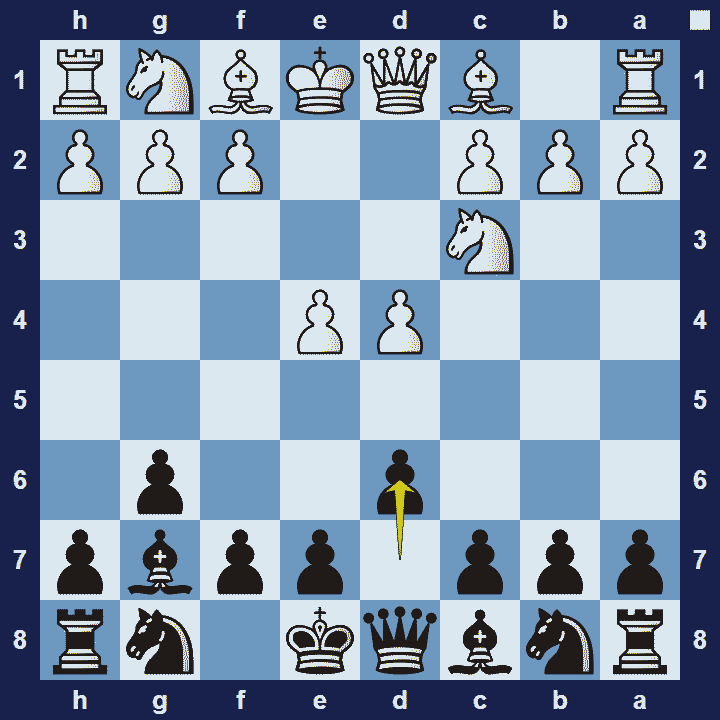

# Modern Defense

## Modern Defense

1.d4 g6

The Modern Defense (also known as the Robatsch Defence after Karl Robatsch), is an opening for black, named after thehypermodern opening strategyit represents (dare the opponent to grab more territory in the centre than they can defend).

### Modern Defense Basic Theory

In typical hypermodern style, Black allows White to occupy the center with pawns and then seeks to undermine this “ideal” center by attacking it–primarily with minor pieces. Black delays Nf6 in order to maximize the effect of the bishop on g7.

A popular variation in the Modern Defense is the Standard Line.

### Modern Defense Standard Line

1.d4 g6 2.e4 d6 3.Nc3 Bg7

In the Modern Defense Standard Line, white plays Nc3 early on. This move blocks the white c-pawn and indicates that white will, for the time being, focus their attention on the centre and the king-side.

### The Pros and Cons of the Modern Defense

The Modern Defense is a very unbalanced opening, which also gives black more opportunities to play for a win. However, black must be very skilled in this opening, else white’s space-advantage and strong hold on the centre can prove too much for black’s awkward development.

## Images

## Extra Information
**Description:** The Modern Defense (also known as the Robatsch Defence after Karl Robatsch) is a hypermodern chess opening in which Black allows White to occupy the center with pawns on d4 and e4, then proceeds to attack and undermine this "ideal" center without attempting to occupy it.. The Modern Defense usually starts with the opening moves: 1. e4 g6. The opening has been most notably used by British ...

**Source:** [Link](https://en.wikipedia.org/wiki/Modern_Defense)
