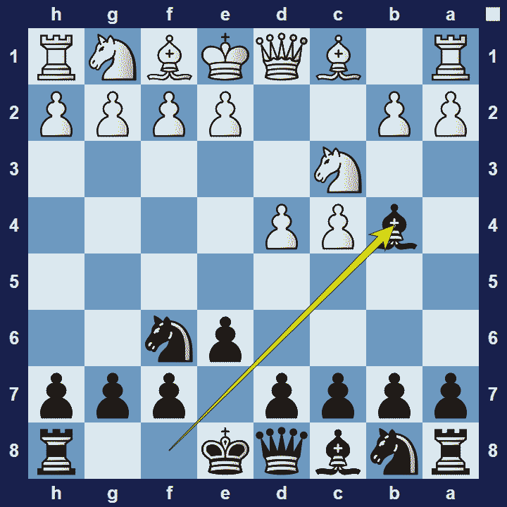
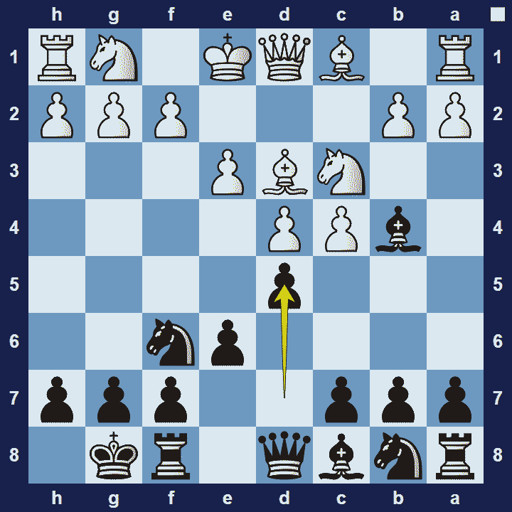

# Nimzo-Indian Defense

## Nimzo-Indian Defense

1.d4 Nf6 2.c4 e6 3.Nc3 Bb4

The Nimzo-Indian Defense is an opening for black, developed by and named after Aron Nimzowitsch. He wrote the famous chess book “My System” and was an avid proponent ofhypermodern openings.

### Nimzo-Indian Defense Basic Theory

In the Nimzo-Indian Defense, black wants to control the e4-squareand all their efforts will support this strategy. Since the white knight on c3 will be a key defender of the e4-square, black wants to exchange their dark-square bishop for this knight. Once this first objective is achieved, Black will also try to keep the position closed because white will have the bishop-pair. (Bishops prefer open positions.)

The Nimzo-Indian Defense is a highly respected opening, to the extent that white sometimes chooses to play the Anti-Nimzo-Indian, where white delays 3.Nc3 (in favor of 3.Nf3) in order to avoid the Nimzo-Indian.

A popular variation in the Nimzo-Indian Defense is the Rubinstein Variation.

### Nimzo-Indian Defense Rubinstein Variation

1.d4 Nf6 2.c4 e6 3.Nc3 Bb4 4.e3 0-0 5.Bd3 d5

In the Rubinstein variation of the Nimzo-Indian Defense, characterized by the move 4.e3, white accepts that the e4-square is under black’s control, for the time being. White then focuses on development first and will address this situation in the center only once their development is complete.

### The Pros and Cons of the Nimzo-Indian Defense

The Nimzo-Indian Defense is a highly respected opening for black that can lead to very interesting positions. However, black may lose the bishop pair and, if white succeeds in holding the centre, black’s position will just be worse.

## Images

## Extra Information
**Description:** The Nimzo-Indian Defense (often called "the Nimzo" for short) is considered one of Black's best responses to White's 1.d4 opener. Black often gives up the bishop pair, but in exchange receives the better pawn structure and easy development. Black will also try to keep the position closed, while White seeks to open up the center for the two bishops.

**Source:** [Link](https://www.chess.com/openings/Nimzo-Indian-Defense)
