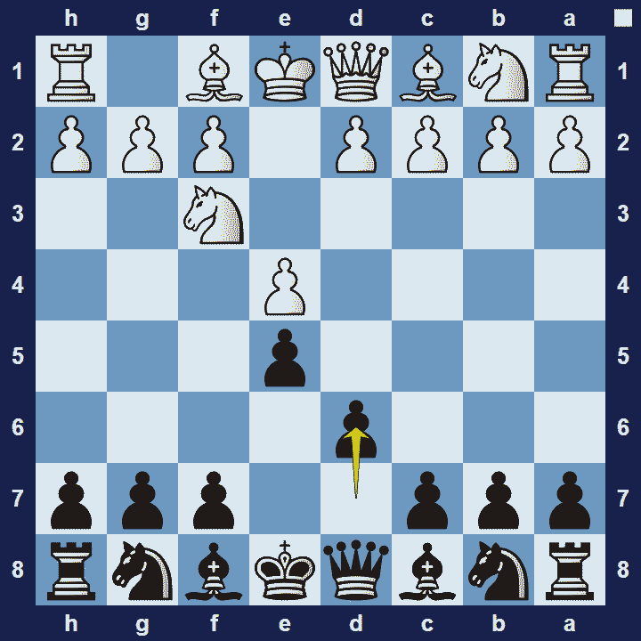
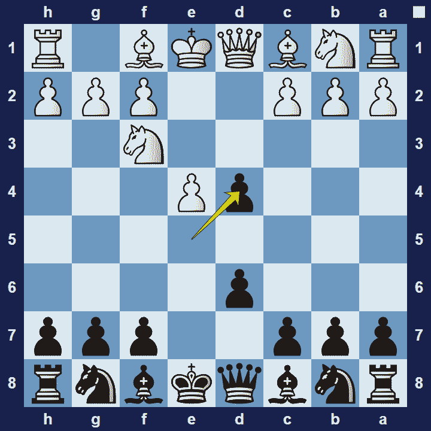

# Philidor’s Defense

## Philidor’s Defense

1.e4 e5 2.Nf3 d6

Philidor’s Defense is an opening for black, named after the famous 18th-century player François-André Danican Philidor. Philidor suggested 2… d6 as an alternative to the commonly played 2…Nc6. It was Philidor who famously said: “… pawns, they are the soul of chess.”

### Philidor’s Defense Basic Theory

It is rather difficult for white to plan an attack against Philidor’s Defense, because black avoids creating any weaknesses in their structure. On the other hand, the pawn on d6 cramps black’s development to some extent. Black typically avoids exchanges and waits for the right moment to launch a counterattack.

A popular variation in Philidor’s Defense is the Exchange Variation.

### Philidor’s Defense Exchange Variation

1.e4 e5 2.Nf3 d6 3.d4 exd4

In the Exchange Variation of Philidor’s Defense, black exchanges the central pawns to release tension in the centre and to avoid tactical complications. This idea makes sense because tactics usually favor the side with better development. White will enjoy a strong centre, whilst black will focus on achieving a strong defense.

### The Pros and Cons of Philidor’s Defense

Philidor’s Defense can be very effective if your goal is to limit white’s options. Black’s position will also be very solid because there are no weaknesses in the pawn-structure. However, black’s dark-square bishop will be rather passive, trapped behind the pawn-structure.

## Extra Information
**Description:** The Philidor Defence (or Philidor's Defence) is a chess opening characterised by the moves: . 1. e4 e5 2. Nf3 d6. The opening is named after the famous 18th-century player François-André Danican Philidor, who advocated it as an alternative to the common 2...Nc6.His original idea was to challenge White's centre by the pawn thrust ...f7-f5.. Today, the Philidor is known as a solid but ...

**Source:** [Link](https://en.wikipedia.org/wiki/Philidor_Defence)
