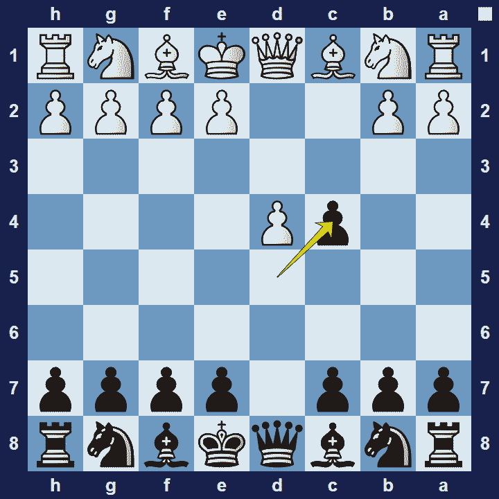
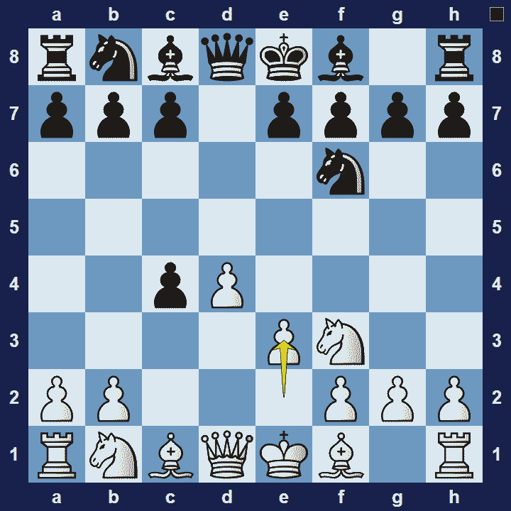

# Queen’s Gambit Accepted

## Queen’s Gambit Accepted

1.d4 d5 2.c4 dxc4

The Queen’s Gambit Accepted is an opening for black that starts with the moves 1.d4 d5 2.c4 dxc4, named after the fact that black accepts the gambit.

### Queen’s Gambit Accepted Basic Theory

When black accepts the gambit, they generally also accept that they will not try to save the pawn. Instead, black will focus on development and typically plan to gain time and space on the queen-side.

A popular variation in the Queen’s Gambit Accepted is the Main Line.

### Queen’s Gambit Accepted Main Line

1.d4 d5 2.c4 dxc4 3.Nf3 Nf6 4.d3

In the Queen’s-Gambit Accepted Main Line, white delays Nc3, in favor of Nf3, because their first priority is to prevent the possibility of black playing e7-e5. The next objective then is to attack and capture the pawn on c4, by playing e3. Black typically won’t waste time trying to defend it, but will later try to gain time and space on the queen-side with moves like c5, a6 and b5 (hitting the white bishop on c4).

## Images

## Extra Information
**Description:** The Queen's Gambit is the chess opening that starts with the moves: [1]. 1. d4 d5 2. c4. It is one of the oldest openings and is still commonly played today. It is traditionally described as a gambit because White appears to sacrifice the c-pawn; however, this could be considered a misnomer as Black cannot retain the pawn without incurring a disadvantage. [2] [3]

**Source:** [Link](https://en.wikipedia.org/wiki/Queen's_Gambit)
