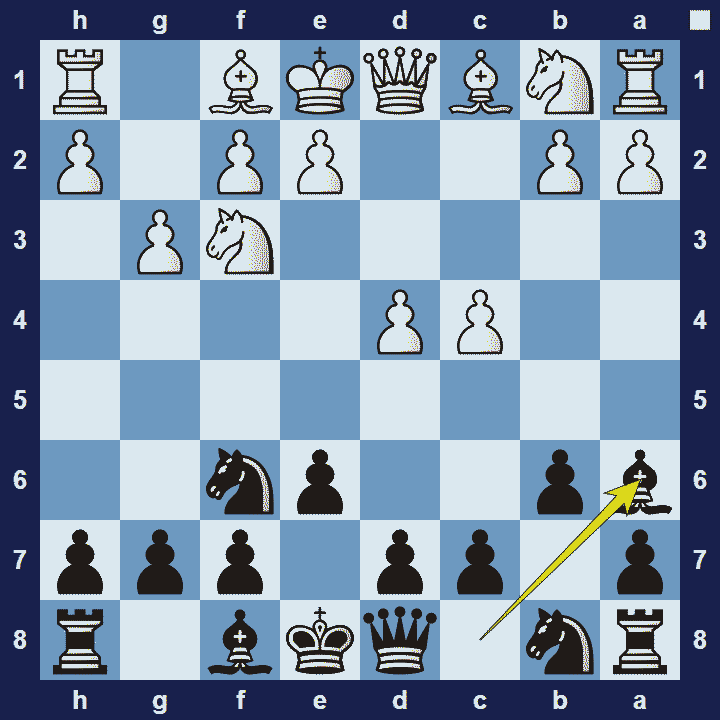

# Queen’s Indian Defense

## Queen’s Indian Defense

1.d4 Nf6 2.c4 e6 3.Nf3 b6

The Queen’s Indian Defense is an opening for black that starts with the moves 1.d4 Nf6 2.c4 e6 3.Nf3 b6. The Queen’s Indian is regarded as the sister opening of the Nimzo-Indian opening because in both openings black wants to take control of the e4-square.

### Queen’s Indian Defense Basic Theory

In typical hypermodern style, black won’t occupy the center with pawns but instead focuses on piece development. If white avoids the Nimzo-Indian Defense with 3.Nf3, black will fianchetto their queen’s bishop with the idea to control the light central squares, particularly the e4-square. Since black’s position will be a bit cramped, black will usually try to exchange a few minor pieces in order to create a bit more space. However, white can get a good position if they can control the e4-square in a favorable manner.

A popular variation in the Queen’s Indian Defense is the Fianchetto Variation.

### Queen’s Indian Defense Fianchetto Variation

1.d4 Nf6 2.c4 e6 3.Nf3 b6 4.g3 Ba6

The Fianchetto Variation of the Queen’s Indian (also called the Modern Main Line) refers to white’s idea to neutralize black’s light-square bishop, by developing their own bishop to this diagonal as well, with Bg2. In this case black may opt to rather play Ba6, hitting the c4-pawn and taking advantage of the fact that white will be weakened on the f1-a6 diagonal.

### The Pros and Cons of the Queen’s-Indian Defense

The Queen’s-Indian Defense is a highly respected opening amongst top-level players. Black avoids weaknesses in their pawn-structure and their pieces usually finds good squares. As with all hypermodern openings though, white will enjoy a space-advantage if they manage to effectively defend the extra territory.

## Extra Information
**Description:** The Queen's Indian Defense [1] (QID) is a chess opening defined by the moves: . 1. d4 Nf6 2. c4 e6 3. Nf3 b6. The opening is a solid defense to the Queen's Pawn Game. [2] 3...b6 increases Black's control over the central light squares e4 and d5 by preparing to fianchetto the queen's bishop, with the opening deriving its name from this maneuver.As in the other Indian defenses, Black attempts to ...

**Source:** [Link](https://en.wikipedia.org/wiki/Queen's_Indian_Defense)
