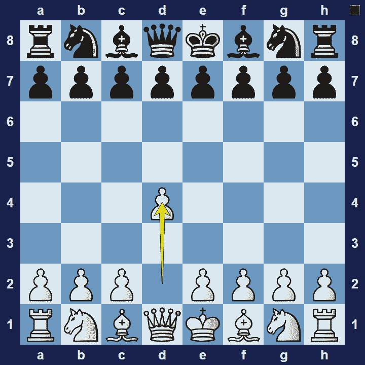
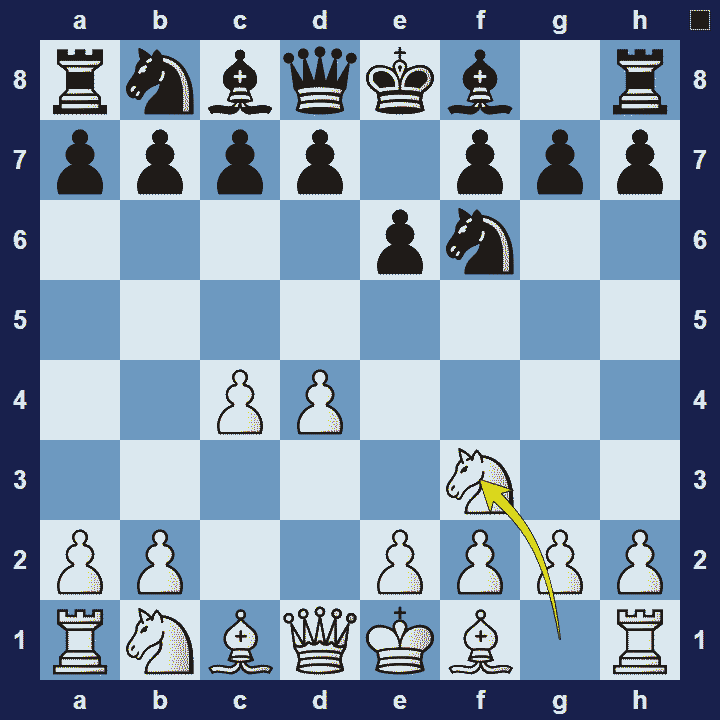

# Queen’s Pawn Game

## Queen’s Pawn Game

1.d4

The Queen’s Pawn Game refers to a family of openings where white starts the game by pushing the pawn in front of their queen, two squares to d4.

### Queen’s Pawn Game Basic Theory

The family of Queen’s Pawn Openings usually leads to slower development (as compared to King’s Pawn Openings). One reason for this is that the pawn on d4 is already defended 9by the queen), whereas with 1.e4, the pawn would not be defended yet. This implies that Queen’s Pawn Openings are generally, but not always, less tactical and more strategic in nature than King’s Pawn Opening. On the other hand, Queen’s Pawn Openings can give white a little more time to play for strategic advantages.

A popular variation in the Queen’s Pawn Game is the Anti-Nimzo-Indian.

### Queen’s Pawn Game Anti-Nimzo-Indian

1.d4 Nf6 2.c4 e6 3.Nf3

White wants to avoid the annoying pin that will be created on their knight after the moves 3.Nc3 Bb4 (the Nimzo-Indian). Therefore, instead of playing 3.Nc3, white goes for 3.Nf3 (the Anti-Nimzo-Indian) and will respond to 3… Bb4+ with 4.Bd2.

### The Pros and Cons of the Queen’s Pawn Game

The Queen’s Pawn Game family of openings is generally slower, less tactical and more strategic in nature (compared to King’s Pawn Game openings). In Queen’s Pawn openings white gets more opportunities to create long-term pressure, but a quick attack on black isn’t likely and king-side development will be slow.

## Images

## Extra Information
**Description:** In the 19th century and early 20th century, 1.e4 was by far the most common opening move by White (Watson 2006:87), while the different openings starting with 1.d4 were considered somewhat unusual and therefore classed together as "Queen's Pawn Game". As the merits of 1.d4 started to be explored, it was the Queen's Gambit which was played most often—more popular than all other 1.d4 openings ...

**Source:** [Link](https://en.wikipedia.org/wiki/Queen's_Pawn_Game)
