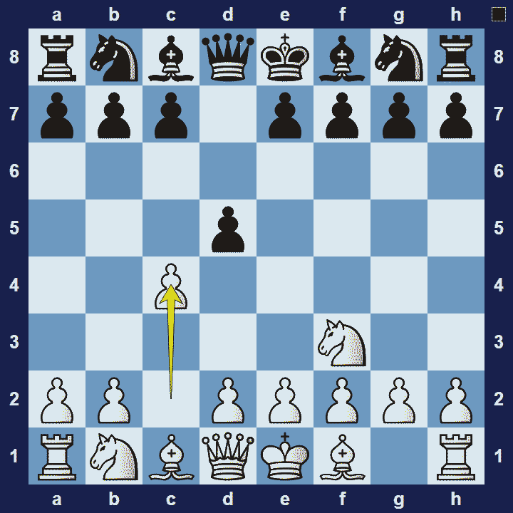
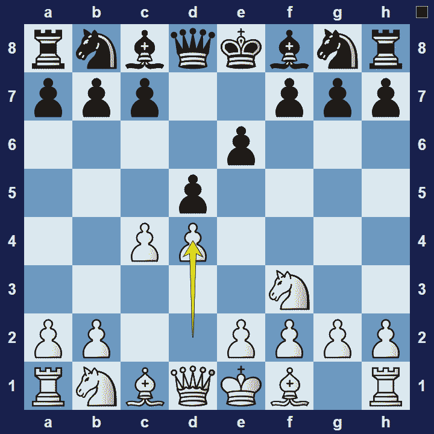

# Réti Opening

## Réti Opening

1.Nf3 d5 2.c4

The Réti Opening is an opening for white, named after the Czechoslovakian chess player, Richard Réti, who defeated José Raúl Capablanca, the reigning world champion at the time, with this opening.

### Réti Opening Basic Theory

Unlike most other openings, the Réti is not a specific but rather a set of themes that characterize the opening. In modern times the Réti Opening refers to white playing Nf3, c4, fianchettoes at least one bishop and does not play an early d4. whereas black plays 1…d5.

A popular variation in the Réti Opening is the Queen’s Gambit (Transposed).

### Réti Opening / Queen’s Gambit Declined (Transposed)

1.Nf3 d5 2.c4 e6 3.d4

The Réti Opening opening often transposes to another opening, typically into the Queen’s Gambit Declined. The player with the white pieces could even pretend to play the Réti Opening (starting with the moves Nf3 and c4) in order to trick their opponent into playing the Queen’s Gambit.

### The Pros and Cons of the Réti Opening

A main advantage of the Réti Opening is that it is very flexible and allows white to easily transpose into other openings. The downside is that black also gets a lot of the same flexibility.

## Images

## Extra Information
**Description:** The Réti Opening is a hypermodern chess opening whose "traditional" or "classic method" begins with the moves: [1]. 1. Nf3 d5 2. c4. White attacks Black's pawn from the flank, which may occasion 2...dxc4.White may couple this plan with a kingside fianchetto (g3 and Bg2) to create pressure on the light squares in the center.. The opening is named after Czechoslovakian chess player Richard ...

**Source:** [Link](https://en.wikipedia.org/wiki/Réti_Opening)
