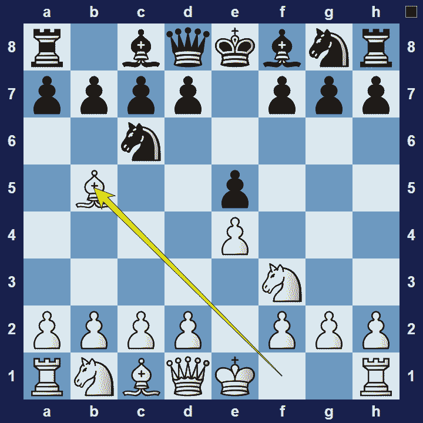
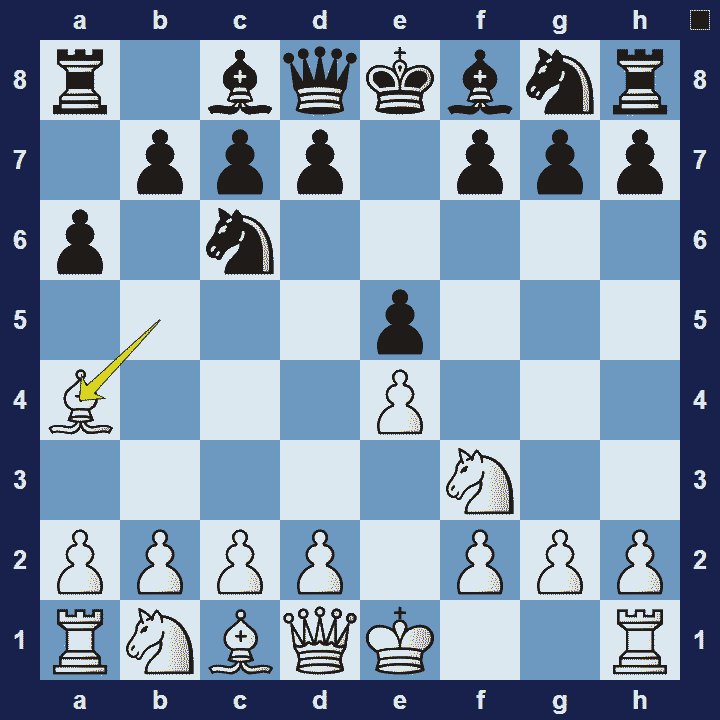

# Ruy Lopez

## Ruy Lopez

1.e4 e5 2.Nf3 Nc6 3.Bb5

The Ruy Lopez is an opening for white, named after a Spanish priest, Ruy López de Segura. Ruy Lopez wrote a book on this and other openings. However, the Ruy Lopez only gained traction in the mid 19th century–when Russian theoretician Carl Jaenisch popularized its use.

### Ruy Lopez Basic Theory

After 1.e4 e5 2.Nf3 Nc6, the move 3.Bb5 is the Ruy Lopez. At its most basic level, the purpose of this move is to add pressure on the e5-square by attacking its main defender (the knight on c6). White is even threatening to win the pawn on e5. It doesn’t work right away though, because after 3… a6 4.Bxc6 dxc6 5.Nxe5, black can play 5… Qd4, attacking the white knight and pawn on e4.

A popular variation in the Ruy Lopez is the Closed Defense.

### Ruy Lopez Closed Defense

1.e4 e5 2.Nf3 Nc6 3.Bb5 a6 4.Ba4

In the Ruy Lopez Closed Defense variation, after 3… a6, white retreats the bishop to a4. Black will typically develop further with 4…Nf6,  5… Be7 and 6… b5, hitting the white bishop again and gaining space on the queen-side.

### The Pros and Cons of the Ruy Lopez Opening

The Ruy Lopez Opening combines the features of typical King’s Pawn openings with the features of typical Queen’s Pawn openings. This means white gets to develop and castle quickly, but also gets some long-term pressure. The downside is that there is a lot of complex theory to learn because black has many options to choose from.

## Images

## Extra Information
**Description:** One of the oldest and most well-liked openings in chess history is the Ruy Lopez Opening, sometimes referred to as the Spanish Opening. Since its analysis in the 1561 book "Libro de la invención liberal y arte del juego del axedrez," written by the Spanish monk Ruy López de Segura in the 16th century, this opening has endured and is still a favorite among amateur and professional players.

**Source:** [Link](https://www.chessdistrict.com/blogs/blog/the-ruy-lopez-opening-in-chess-a-comprehensive-guide)
