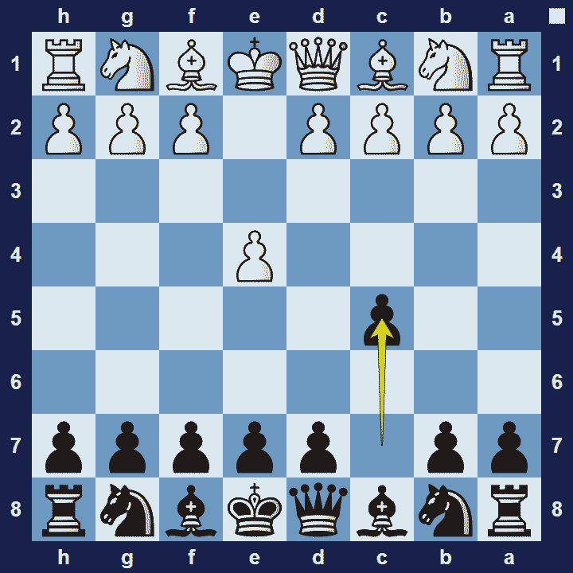
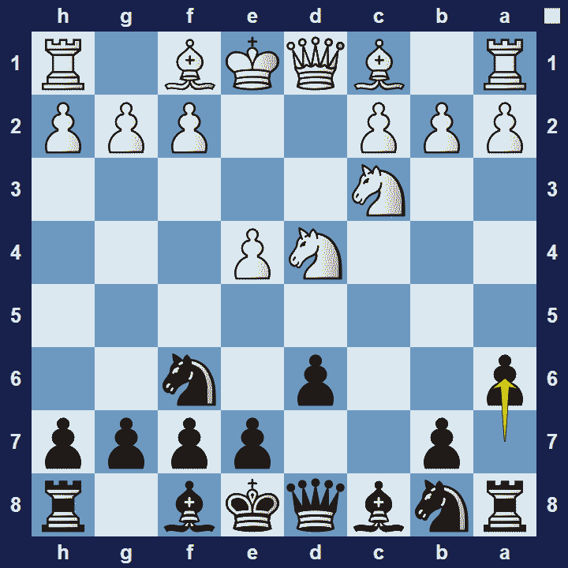

# Sicilian Defense

## Sicilian Defense

1.e4 c5

The Sicilian Defense is an opening for black, named after Sicily, a region in Italy, since the earliest noted on the opening were recorded by the Italian chess players Giulio Polerio and Gioachino Greco.

### Sicilian Defense Basic Theory

In the Sicilian Defense, black upsets the balance in the position on their very first move, which declares they are ready for a fight.

The Sicilian Defense is a counter-attacking opening where the players typically attack on opposite sides of the board. Black typically expands on the queen-side with …a6 and …b5, and play along the semi-open c-file. And since black’s c-pawn has moved, black will typically castle to the short side. White, on the other hand, will seek to crash through the centre–into black’s position–or potentially launch an attack on black’s king-side. White’s strategy will be very effective if black fails to defend the centre.

A popular variation in the opening is the Sicilian Defense is the Najdorf Variation.

### Sicilian Defense Najdorf Variation

1.e4 c5 2.Nf3 d6 3.d4 cxd4 4.Nxd4 Nf6 5.Nc3 a6

The Najdorf Variation of the Sicilian Defense is characterized by the move 5…a6. This move controls the b5-square and prevents white’s pieces to use the b5 square. 5.. a6 also support …b5, after which black could develop their light-square bishop on b7. White gets a temporary lead in development and extra space. But since black’s position is free of weaknesses, white will find it difficult to plan an attack on black’s position.

### The Pros and Cons of the Sicilian Defense

Practitioners of the Sicilian Defense typically want to creates unbalanced positions–which the Sicilian Defense does from the very first move. Since the opening gives black good attacking chances, it is a logical choice when black wants to play for a win. The downside is that white has many continuations to choose from and therefore black needs to study a lot of theory if they want to employ the Sicilian Defense with confidence.

## Extra Information
**Description:** The Sicilian Defence: History, Strategy, and How to Play It . The Sicilian Defence is one of the most popular and aggressive responses to 1.e4 in chess. Played at all levels—from beginners to world champions—it is a highly dynamic opening that often leads to rich, tactical battles. Origins and History of the Sicilian Defence

**Source:** [Link](https://www.chess.com/blog/Potato_chips01/the-sicilian-defence-history-strategy-and-mastering-the-most-dynamic-chess-opening)
