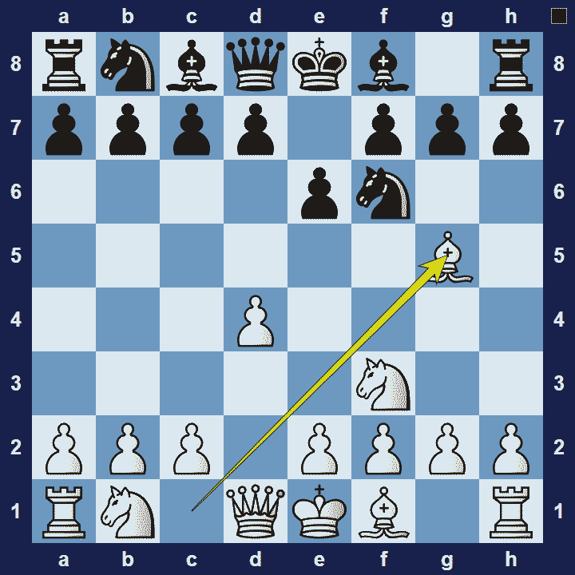
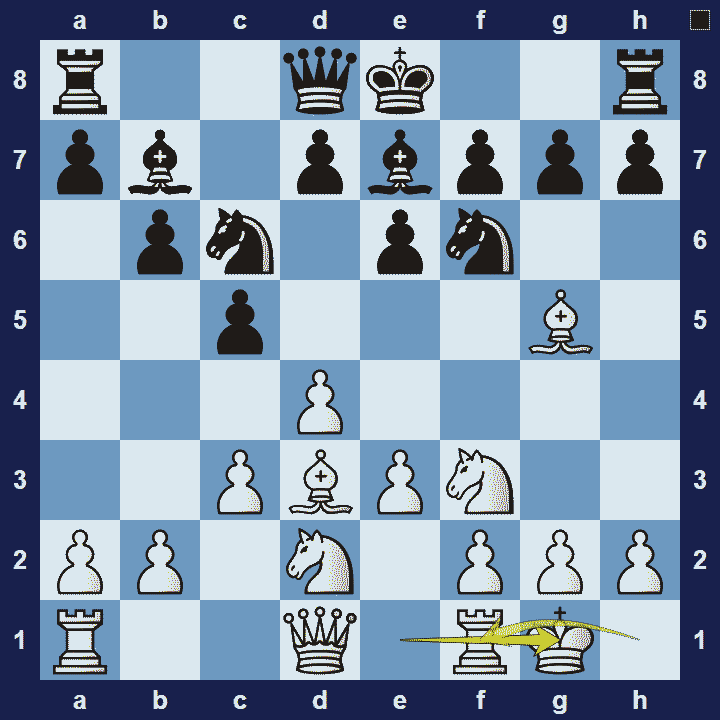

# Torre Attack

## Torre Attack

1.d4 e6 2.Nf3 Nf6 3.Bg5

The Torre Attack is an opening system for white, named after the Mexican grandmaster Carlos Torre, who often played this opening and even beat former World Champion Emanuel Lasker with it.

### Torre Attack Basic Theory

The Torre Attack is a system opening that is in fact very similar to the London System. In the Torre Attack, white’s dark-square bishop goes to g5 (in the London System this bishop goes to f4). White aims to occupy the center with pawns and prepares to play e3-e4 once the square is supported from a knight on d2, a bishop on d3 and, possibly, a rook on e1. Another common idea is to attack on the kingside, starting with Ne5 and then f4.

A popular variation in the Torre Attack is the Classical Defense.

### Torre Attack Classical Defense

The Torre Attack Setup against black’s Classical Defense:

The Torre Attack Classical Defense is characterized by the move c7-c5. Black uses their c-pawn to put pressure on white’s d-pawn. This move, as well as black’s future moves–b6, Bb7 and d5, makes it much harder for white to eventually play e3-e4.

### The Pros and Cons of the Torre Attack

The Torre Attack is a system opening and for studying very little theory, white get easy development, a solid centre and some attacking chances. However, since white doesn’t create any tension in the centre, there are many ways a well-prepared opponent can make it difficult for white to prove any advantage.

## Images

## Extra Information
**Description:** White pursues quick and harmonious development, will bolster his d4-pawn by c2-c3, then often enforces e2-e4 to obtain attacking chances on the kingside as the Torre bishop pins the f6-knight. If White plays an early c4, the opening will transpose to a number of more common queen pawn openings, such as the Queen's Gambit or one of the various Indian defences.

**Source:** [Link](https://en.wikipedia.org/wiki/Torre_Attack)
