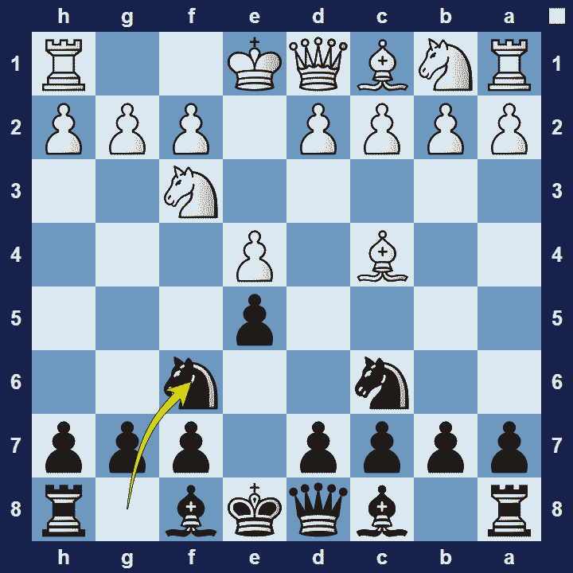
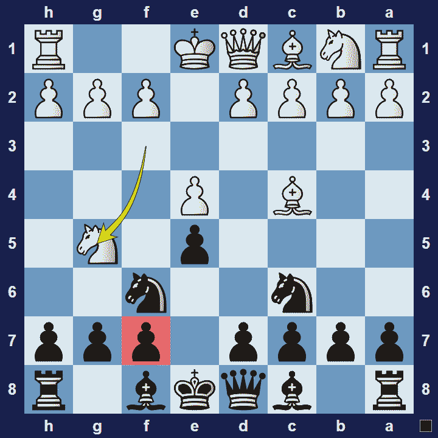

# Two Knights Defense

## Two Knights Defense

1.e4 e5 2.Nf3 Nc6 3.Bc4 Nf6

The Two Knights Defense (sometimes referred to as the Chigorin Counter-Attack) is an opening for black, named after the fact that black develops both knights before moving a bishop.

### Two Knights Defense Basic Theory

If black plays the Two Knights Defense, they are (usually) either ignorant of the Fried Liver Attack, or they want to tempt white to try it. If white isn’t tempted though, the game will most likely transpose into a variation of the Italian Game, Giuoco Pianissimo.

Note:If black wants to play the Two Knights Defense, it is imperative that they know how to deal with the Fried Liver Attack.

#### Fried Liver Attack

1.e4 e5 2.Nf3 Nc6 3.Bc4 Nc6 4.Ng5!? threatening Nxf7.

Black must be very well versed in the theory of the Fried Liver Attack if they want to survive the onslaught. For example, after 4.Ng5 d5 5.exd5 Nxd5? (Na5 is correct) 6.Nxf7!? Kxf7 7.Qf3+ black is in an almost losing position.

Note that if black played 3… Bc5, then 4.Ng5? can be met with Qxg5. Or 3… Bc5 4.Nc3 Nf6 5.Ng5 0-0 is good for black.,

### The Pros and Cons of the Two Knights Defense

The Two Knights Defense tempts white to play the Fried Liver Attack. If black knows how to defend against the Fried Liver, they will get a playable position. But if black is unfamiliar with the best variation against the Fried Liver, they may get destroyed quickly. Also, black won’t get much of the action if white chooses to play a slow, strategic game.

## Extra Information
**Description:** The Two Knights Defense (also called the Prussian Defense) is a chess opening that begins with the moves: . 1. e4 e5 2. Nf3 Nc6 3. Bc4 Nf6. First recorded by Giulio Cesare Polerio [2] (c. 1550 - c. 1610) in the late 16th century, this line of the Italian Game was extensively developed in the 19th century. Black's third move is a more aggressive defense than the Giuoco Piano ().

**Source:** [Link](https://en.wikipedia.org/wiki/Two_Knights_Defense)
