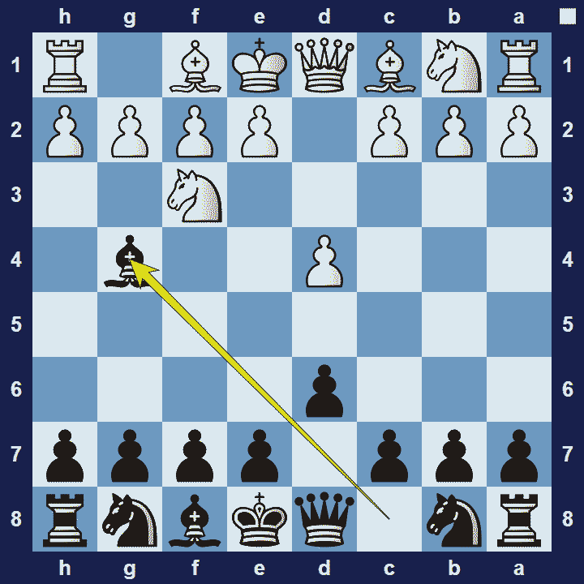
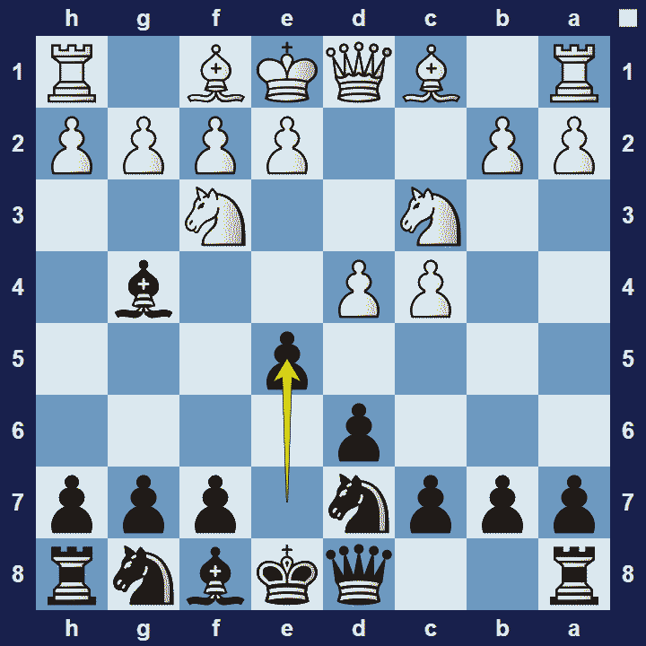

# Wade Defense

## Wade Defense

1.d4 d6 2.Nf3 Bg4

The Wade Defense is an opening for black, named after the British International Master Bob Wade, who often played this opening during his chess career. Modern Grandmasters Peter Svidler and Micheal Adams also played this opening on more than just a few occasions.

### Wade Defense Basic Theory

Right from the word go, black’s light-square bishop exerts some annoying influence on white’s knight. This implies that black may have in mind to fight for the d4- and e5-squares.

A popular variation in the Wade Defense is the Main Line.

### Wade Defense Main Line

1.d4 d6 2.Nf3 Bg4 3.c4 Nbd7 4.Nc3 e5

The fact that black plays 3… Nd7 is more evidence that they want to counter-strike in the centre with e7-e5 (the Wade Defense Main Line).

### The Pros and Cons of the Wade Defense

Even though The Wade Defense opening is played surprisingly often, there is very little known theory on it. Modern computer engines (and database statistics) suggest that either 3.e4, 3.c4 or 3.Nc3 should be good for white.

## Extra Information
**Description:** The opening is named after British IM Bob Wade [1] (1921-2008), originally from New Zealand, who played it for over 30 years.A number of grandmasters have often played the opening, including Julian Hodgson, Michael Adams, Vlastimil Jansa, and Tony Miles.. Jouni Yrjölä and Jussi Tella, in their book An Explosive Chess Opening Repertoire for Black, state that the opening:

**Source:** [Link](https://en.wikipedia.org/wiki/Wade_Defence)
